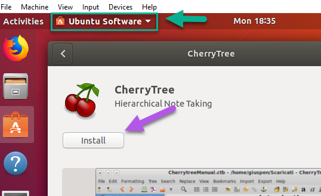
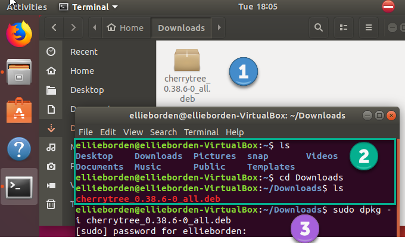
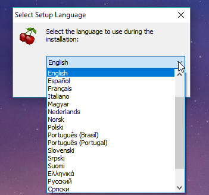
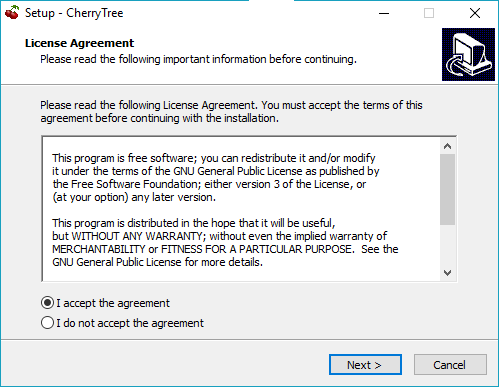
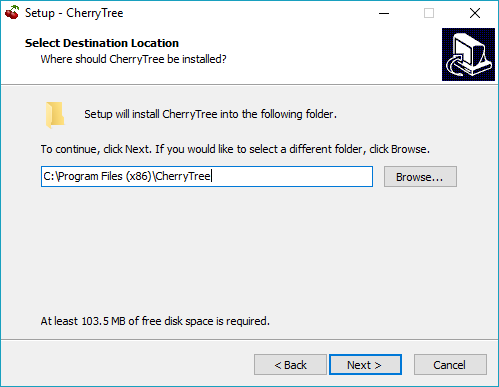
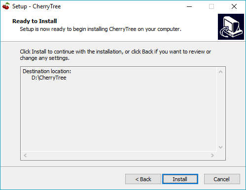
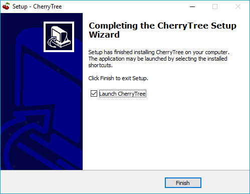
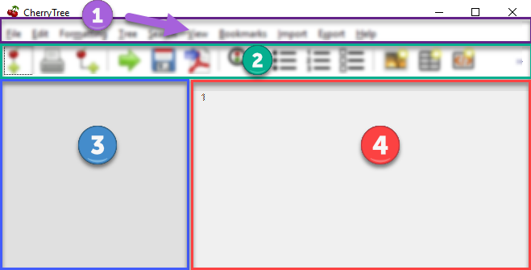
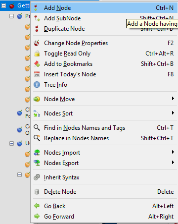
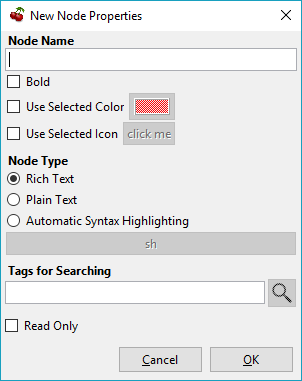

<!--
TODO Finish outline and move content from original to new version
TODO Remove fluff from content
TODO Compare images with application and replace or annotate where as needed
TODO Test all current instructions
TODO Add new content as needed
-->

 Cherrytree User Manual
===

* [Introduction](#introduction)
  * [About This Manual](#about-this-manual)
  * [Get Involved](#get-involved)
* [Installation](#installation)
  * [Installing on Fedora and other Red Hat derivatives](#installing-on-fedora-and-other-red-hat-derivatives)
  * [Installing on Ubuntu and other Debian derivatives](#installing-on-ubuntu-and-other-debian-derivatives)
  * [Installing on Windows](#installing-on-windows)
* [Quick start](#quick-start)
  * [Interface](#interface)
  * [Create Nodes](#create-nodes)
  * [Insert an Image](#insert-an-image)
  * [Save Your Notes](#save-your-notes)
  * [Export the Document](#export-the-document)
* [User Interface](#user-interface)
  * [Editor](#editor)
  * [Tree View](#tree-view)
  * [Toolbar](#toolbar)
  * [Menu](#menu)
* [Files](#files)
  * [Create a New Document](#create-a-new-Document)
  * [Open a File](#open-a-file)
  * [Save Your Work](#save-your-work)
  * [Print a Document](#print-a-document)
  * [Execute a Code Snippet](#execute-a-code-snippet)
  * [Import Files](#import-files)
  * [Export Files](#export-files)
* [Nodes](#nodes)
  * 
* [Text](#text)
  * 
* [Objects](#objects)
  * 
* [Searching](#searching)
  * 
* [Settings](#settings)
  * 
* [Contributors](#contributors)
  * 
* [Supporters](#supporters)
  * 
* [License](#license)
  * 

---

# Introduction

Cherrytree is a free and open source, hierarchical, note-taking application. It can store text, images, files, links, tables, and executable snippets of code. This application is under active development. Details regarding updates can be found in the [changelog](https://github.com/giuspen/cherrytree/blob/master/changelog.txt). 

If you have questions please ask in the [forum](https://www.giuspen.com/forum/cherrytree-2/), or visit [this webpage](https://www.giuspen.com/feedback/) to provide feedback.

### About This Manual

This manual was written for Cherrytree version 0.38.6. Please check the [Cherrytree website](http://www.giuspen.com/cherrytree/) for the latest version. 

### Get Involved

New contributors are welcome!

**Development**  

The git repository can be found [here](https://github.com/giuspen/cherrytree).

The current version of Cherrytree requires:

* python2
* python-gtk2
* python-gtksourceview2
* p7zip-full
* python-dbus
* python-enchant
* python-chardet

After cloning, run in the top folder ./cherrytree or python2 cherrytree.

Development is currently focused on porting from Python to C++/GTKmm. These changes are located on the master branch within the ['future' directory](https://github.com/giuspen/cherrytree/tree/master/future). The latest, stable release can also be found on the master branch. The pygi branch is a discontinued attempt to port to the python bindings for GTK3. It failed due to python-gtksourceview2 being deprecated.
  
**Testing**

If you find a bug, please check to see if it has already been reported within the project's index of [issues](https://github.com/giuspen/cherrytree/issues). If the error is unreported, please create a new issue providing as much detail as possible.

If needed, here is a short guide on [writing a proper GitHub issue](https://medium.com/nycplanninglabs/writing-a-proper-github-issue-97427d62a20f).
  
**Writing**  

The Cherrytree user manual is currently under revision and is maintained [here](https://github.com/EllieBorden/Cherrytree-Manual).
  
**Translation**  
  
**Donations**  
  
Join the [Cherrytree Supporters](#supporters)!
  
Donations are appreciated and can be made from the [Cherrytree homepage](https://www.giuspen.com/cherrytree/#text-3).

---

# Installation

Cherrytree is available for Linux and Windows.

### Installing on Fedora and other Red Hat derivatives

1. Download the latest installer with a '.rpm' extension from the [downloads webpage](https://www.giuspen.com/cherrytree/#downl).
2. Open a terminal and navigate to the directory where your installer is located.
3. Type the following command, replacing "cherrytree.rpm" with the name of your installation file:
  `sudo rpm -Uvh --force cherrytree.rpm`. Provide your password when prompted to begin the installation.  
  

### Installing on Ubuntu and other Debian derivatives

***Option One: Ubuntu Software***

Cherrytree can be found in the Ubuntu Software library. Open Ubuntu Software and search for Cherrytree, then select the application and click the 'install' button. Provide your password when prompted to begin the installation.

**Option Two: Command Line**

1. Download the latest installer with a '.deb' extension from the [downloads webpage](https://www.giuspen.com/cherrytree/#downl).
2. Open a terminal and navigate to the directory where your installer is located.
3. Type the following command, replacing "cherrytree.deb" with the name of your installation file:
  `sudo dpkg -i cherrytree.deb`. Provide your password when prompted to begin the installation.  
  

### Installing on Windows

1. Download and run the latest installer with an '.exe' extension from the [downloads webpage](https://www.giuspen.com/cherrytree/#downl).
  
2. Select a language and click the 'Next' button.  

  
3. Accept the license, then click the 'Next' button.  

  
4. Select a directory for the application to be installed and click the 'Next' button.  

  
5. Select 'Create a desktop shortcut' if you wish to have a shortcut. Click the 'Next' button.  

  
6. Review then provided summary, then click 'Install' if you are ready to proceed.  

7. Click 'Finish' to complete the installation.  

  
**Note:** If you have a previous version of Cherrytree installed, an error may occur when trying to overwrite “dbus-daemon.exe”. If so, please skip the overwrite and restart your computer, then try again.

---

# Quick start

This brief quick start guide will teach you about the following:

* User Interface
* Nodes
* Core Text Editing
* Inserting images
* Saving
* Exporting

### Interface

Cherrytree's interface is made of four sections. These sections are highlighted in the image below:

**Menu Bar (Red)**  

The menu bar contains the following menus:

* File - Document-management features such as opening, saving, printing, and exporting.
* Edit - Application preferences, basic copy and paste features, and object insertion features.
* Formatting - Text formatting options.
* Tree - Node management features.
* Search - Features for search and replace.
* View - Interface options.
* Bookmarks - Bookmarks will be listed in this menu. You can add bookmarks by right-clicking a node within the tree view and selecting the "Add to Bookmarks" option.
* Import - Cherrytree can import from a variety of sources including KeepNote, NoteCase, Tomboy, HTML files, others.
* Export - Cherrytree documents can be exported to HTML, PDF, and Plain Text.
* Help - Contains "Check for updates", an "About" section, and a link to the online manual."

**Toolbar (Purple)**  

The toolbar has many commonly used options for managing nodes, formatting text, and inserting objects. 

The toolbar can be edited by clicking "Edit" within the menu bar and navigating to "Preferences > Toolbar"

The size of the toolbar icons has been increased within the image above. Icon size can be changed by clicking "View" in the menu bar, then selecting the "Increase Toolbar Icon Size" option for bigger icons or "Decrease Toolbar Icon Size" for smaller icons..

**Tree View (Green)**  

Cherrytree's tree view shows the document's hierarchical structure of nodes. Right-click a node to display a menu of the options available to it.  

**Editor (Yellow)**  

The editor is used to read, write, edit, and delete notes. Click and hold the divider between the tree view and editor, then drag the mouse left or right to resize the two windows. 

To change the color scheme for plain text documents and code, click the "Edit" button within the menu bar and navigate to "Preferences > Plain Text and Code," then adjust the Style Scheme option. To change the color scheme of Rich Text documents, click "Edit", navigate to "Preferences > Rich Text" and adjust the Theme settings.

### Node Management

**Creating New Nodes**

1. Click the "Add Node" button within the menu bar to display the "New Node Properties" menu.   

2. Give your node a name and select a node type, then click the "OK" button. If you're unsure which node type to use, please view the [node type section](#choosing-a-node-type) of this manual.  

**Node Structure** 

**Deleting Nodes**

### Insert Objects

Content

### Save Your Notes

Content

### Export the Document

Content

---

# User Interface

**Resizing the interface**  
Click and hold the divider between the tree view and editor, then drag the mouse left or right to resize the two windows.

### Editor

Content

### Tree View

Content

### Toolbar

**Toolbar Icons**  
Icon size can be changed by clicking "View" in the menu bar, then selecting the "Increase Toolbar Icon Size" option for bigger icons or "Decrease Toolbar Icon Size" for smaller icons..

### Menu

Content

---
# Files

Content

### Create a New Document

Content

### Open a File

Content

### Save Your Work

Content

### Print a Document

Content

### Execute a Code Snippet

Content

### Import Files

Content

### Export Files

Content

---

# Nodes

Content

### Managing Nodes

Content

### Choosing a Node Type

Content

**Plain Text** Content  
**Rich Text** Content  
**Syntax Highlighting** Content  

### Editing Nodes

Content

### Deleting Nodes

Content

---

# Text

Content

---

# Objects

### Images

Content

**Drag and drop** content  

**Copy and paste** content  

**Toolbar** content  

### Tables

### Codebox

content

**The following Codebox formats are available:**

* ada
* asp
* awk
* bibtex
* boo
* c
* c-sharp
* cg
* changelog
* chdr
* clisp
* cmake
* cpp
* css
* d
* desktop
* diff
* docbook
* dosbatch
* dot
* dpatch
* dtd
* eiffel
* erlang
* fcl
* forth
* fortran
* fsharp
* gap
* gettext-translation
* glsl
* go
* groovy
* gtk-doc
* haddock
* haskell
* haskell-literate
* html
* idl
* ini
* java
* js
* latex
* libtool
* lua
* m4
* makefile
* mallard
* markdown
* markdown-extra
* msil
* nemerle
* nisi
* objc
* objective-caml
* ocl
* octave
* ooc
* pascal
* perl
* php
* pkgconfig
* powershell
* prolog
* python
* python3
* r
* rpmspec
* ruby
* rust
* scala
* scheme
* sh
* sparql
* sql
* t2t
* tcl
* texinfo
* vala
* vbnet
* verilog
* vhdl
* xml
* xslt
* yacc
* yaml

**Executing**

### Files

Content

### Links

Content

### Anchors

Content

### Table of Contents

Content

### Time Stamps

Content

### Special characters

Content

---

# Searching

Content

---

# Settings

Content 

---

# Contributors

Cherrytree is written and maintained by Giuseppe Penone.  

**Development:**

**Writing:**

* Robert Boudreau
* Ellie Borden

**Translation:**

* Pavel Fric (Czech)
* Vincenzo Reale (Italian)
* Klaus Becker (French)
* Frank Brungräber (German)
* Giuseppe Penone (Italian)
* Marcin Swierczynski (Polish)
* Andriy Kovtun (Russian, Ukrainian)
* Daniel MC (Spanish)
* Channing Wong (Chinese Simplified)
* Vinicius Schmidt (Brazilian Portuguese)
* Patrick Vijgeboom (Dutch)
* Luuk Geurts (Dutch)
* Seda Stamboltsyan (Armenian)
* Ferhat Aydin (Turkish)
* Piyo (Japanese)
* Zygis (Lithuanian)
* Henri Kaustinen (Finnish)
* Delphina (Greek)
* Erik Lovrič (Slovenian)

**Artwork:**

* OCAL
* Zeltak
* Angelo Penone

All email addresses can be found in Cherrytree by selecting 'Help > About > Credits' from the menu.

---

# Supporters

* Andy Lavarre (United States) donated €350 {android, creation/modification per node + search filter}
* Miguel Latorre (Spain) donated €240
* DistroWatch.com (International) donated €200
* Alan M. (United States) donated €100
* Mario (Austria) donated €100
* 1001bricks (France) donated €80 {custom keyboard shortcuts}
* Michael Moyer (United States) donated €70
* Charles Leis (United States) donated €65
* Rene Gommes (Italy) donated €55
* Samir Derzic (Germany) donated €55
* Stuart Krivis (United States) donated €55
* Barbara Buri (Switzerland) donated €50
* Ger de Gooijer (Netherlands) donated €50 {mark node in the tree with bold or color}
* Lisardo Sobrino (Spain) donated €50
* Manuel Pacheco (Spain) donated €50
* Rudy Witt (Canada) donated €50
* Steve Davis (United States) donated €50
* Valentina Ermolova (Russia) donated €47
* Édipo Gonçalves (Brazil) donated €45
* Ted (Germany) donated €45 {same tree visible twice for drag n drop}
* James Brady donated €43,24
* Andrew Marquis (United Kingdom) donated €40
* Jack Downes (United States) donated €40
* Sylvain Pasche (Switzerland) donated €40
* Thomas Ludwig (Germany) donated €40
* William Haschke (United States) donated €40
* Juan Rivera (Spain) donated €35
* Marian Förster (Germany) donated €35
* Glen Garfein (United States) donated €31,25
* Jt Spratley (United States) donated €31
* Christoph Rottleb (Germany) donated €30
* Fabien Perdu (France) donated €30 {keyboard shortcut for subscript and superscript or a way to configure them}
* Giulio Achilli (Italy) donated €30
* Ivar Christopher (United States) donated €30
* Jan Axelsson (Sweden) donated €30 {nodes icons or colors and nodes separator}
* Jesse Sloane (South Korea) donated €30
* Johnathan Moseley (United States) donated €30
* Josh Hanson (United States) donated €30 {sub item pressing the TAB key in lists}
* Luis Ribeiro (Portugal) donated €30
* MC Merchants (United States) donated €30
* Michael Jabbour (Austria) donated €30
* Miguel Gestal (Spain) donated €30
* Ravinderpal Vaid (United States) donated €30
* Steven Rockefeller (United States) donated €30
* Sebastian Prodan (Germany) donated €26
* Michael Turner (United States) donated €25,99
* Bruce Ashford (United Kingdom) donated €25
* Claus Otterpohl (Germany) donated €25
* Georg Fellmann (Germany) donated €25
* James Lin (United States) donated €25
* John DeOrian (United States) donated €25 {bulleted list indentation hierarchical, Integrate LaTeX (mathematical formulas)}
* Miguel Vilar (Switzerland) donated €25
* Soren ONeill (Denmark) donated €25
* Wolfgang See (Germany) donated €25
* Jaroslav Polacek (Czech Republic) donated €22,22
* Andreas Strömdahl (Sweden) donated €20
* Andrew Golovanov (United States) donated €20
* Anthony Miller (United Kingdom) donated €20
* David Butcher (United Kingdom) donated €20
* David Condray (United States) donated €20
* Emmanuel Chantreau (France) donated €20
* Evan Tran donated €20
* Fabio rahamim (Israel) donated €20
* Francesco Zaniol (Australia) donated €20
* Frank Dehmel (Germany) donated €20
* Frank Nash donated €20
* Gaurav Pal (United Kingdom) donated €20
* Gene Clem (United States) donated €20
* Geoffrey Munn (United Kingdom) donated €20
* Hermann Grell (Germany) donated €20
* J Walters (United Kingdom) donated €20
* Jaroslav Svobboda (Czech Republic) donated €20
* Joerg Materna (Germany) donated €20
* John McCoy donated €20
* John Parkin (United Kingdom) donated €20
* José Martínez (Spain) donated €20
* Ken Dangerfield (Canada) donated €20
* Laurent Soulet (France) donated €20
* Lee Rottler (United States) donated €20
* Michael Matney (United States) donated €20
* Randall Raziano (United States) donated €20
* Rich Edwards donated €20
* Robert Johansson (Sweden) donated €20
* Roberto Diaz donated €20
* Roger Rowles (Australia) donated €20
* Rudolf Waltenberger (Austria) donated €20
* Rudy Witt (Canada) donated €20
* Timothy DeCant (United States) donated €20
* Zigurds Gavars (Latvia) donated €20 {better table cells support}
* Gerry Williams (United States) donated €17,86
* Christopher Davenport (United States) donated €16
* Christopher Brazill (United States) donated €15
* Hannes Mertl (Austria) donated €15
* Hans van Meteren (Netherlands) donated €15
* Istvan Cebrian (Portugal) donated €15
* Jason Fossen (United States) donated €15 {tabs}
* John Duchek (United States) donated €15
* John Grant (United Kingdom) donated €15
* John Reynolds (United States) donated €15
* Joshua Chalifour (Canada) donated €15
* Kees Wiebering (Germany) donated €15
* Klaas Vaak (Netherlands) donated €15
* Lukas Golombek (Germany) donated €15
* Marwan Nader (Canada) donated €15
* Patricia Bonardi (Netherlands) donated €15
* Robert Madore (Canada) donated €15
* Duncan M.K. (United Kingdom) donated €12,5
* Bennett Z. Kobb (United States) donated €12,39
* Dandi Soft (Italy) donated €12
* Administrateur (France) donated €10
* Aleksandrs Demcenko (Latvia) donated €10
* Alexandr Blashin (Germany) donated €10
* Aviv De Morgan (Israel) donated €10
* Balint Fekete (Hungary) donated €10
* Benoît D’Angelo (France) donated €10
* Bruno Pietzsch (Germany) donated €10
* Chipmunk Software &amp; Systems (United States) donated €10
* Christian Saad (Germany) donated €10
* Claus Karstensen (Denmark) donated €10
* Cosmin Saveanu (France) donated €10
* Daniel Toro (Chile) donated €10
* Darren Wood (United States) donated €10
* David Allinson (United Kingdom) donated €10
* Dennis Roberts (United States) donated €10
* Derek Perry (Canada) donated €10
* Dinu Catalin (Romania) donated €10
* Eric Jourdan (France) donated €10
* Eva Rothwangl donated €10
* Glenna Drake (United States) donated €10
* Gregory Bruccoleri (United States) donated €10
* Guillaume Michaud (Canada) donated €10
* iCore effective GmbH (Germany) donated €10
* Jack (Croatia) donated €10
* Jesus Arocho (United States) donated €10
* Joachim Manke (Germany) donated €10
* Kåre Jensen (Denmark) donated €10
* Lachlan Brown (Australia) donated €10
* Larry Apple (United States) donated €10
* Laura Haglund (United States) donated €10
* Leonardo Gonçalves (Brazil) donated €10
* M A Richard (United States) donated €10
* Marcelo Bovo (Brazil) donated €10
* Marilena Marrone (Italy) donated €10
* Matthew Minnix (United States) donated €10
* Mika Kujanpää (Finland) donated €10
* Mustafa Kabakcioglu (Turkey) donated €10
* Nenad Jemuovic donated €10
* Oscar (Mexico) donated €10
* Passionate Awakenings (United States) donated €10
* Paul Saletan (United States) donated €10
* Petr Bartel (Czech Republic) donated €10
* Philippe Missout (France) donated €10
* Ranjit Singh (Germany) donated €10
* Ravi Kumar (India) donated €10
* Robert Harris (United States) donated €10
* Ronald Cameron (United States) donated €10
* Rudy Richardson (United States) donated €10
* Ryan Riedel donated €10
* Silton Tennis (United States) donated €10
* Stanescu Ionut (New Zeland) donated €10
* Stefano Landi (Canada) donated €10
* Stridor Media (Germany) donated €10
* Tai Wei Feng (Australia) donated €10
* Thomas Gruschwitz (Germany) donated €10
* Thomas Locquet (France) donated €10
* Thomas Polomski (Germany) donated €10
* Uwe Ebers (Germany) donated €10 {android version}
* ZebraMap (United States) donated €10
* James Skahan (United States) donated €9 {shortcut to leave the codebox}
* David Severn (United States) donated €8,82
* Daniel Siefert (Germany) donated €8
* Graham Osborne (United Kingdom) donated €8
* Richard Trefz (United States) donated €8
* Kastytis Belazaras (Lithuania) donated €7,77
* Winfred McCarty (United States) donated €7,66
* Mark Kasper donated €7,25
* Angus Rose (United Kingdom) donated €7
* Gerard Dubrulle (France) donated €7
* Siliconninja donated €7 {individual pages/nodes instead of one document file for cloud syncing}
* Tara Stewart (United States) donated €6
* Thomas Bondois (France) donated €6
* Nick Cross (United Kingdom) donated €5,80
* Alexander Eckert (Germany) donated €5
* Alexander Lackner (Germany) donated €5
* Benjamin Westwood (United Kingdom) donated €5
* Daniel Elias (Brazil) donated €5
* Dylan Goodman donated €5
* Gerben Tijkken (Netherlands) donated €5
* Gloria See donated €5
* Ivo Grigull (Germany) donated €5
* Karsten Kulach (Germany) donated €5
* Katarzyna Górnisiewicz (Poland) donated €5
* Luca Bevilacqua (Italy) donated €5
* Marian Hanzel (Slovakia) donated €5
* Mario Tosques (Italy) donated €5
* Marius Van der Merwe (Australia) donated €5
* Massimo Beltramin (Italy) donated €5
* Mathias Huber donated €5
* Max Greisen (Belgium) donated €5
* Maxime Lahaye (United States) donated €5
* Michael Schönwälder (Germany) donated €5
* Michelle Thompson (United States) donated €5
* Jiri Kouba donated €5
* Olivier Le Moal (France) donated €5
* Open Source Solutions (Bulgaria) donated €5
* Paul Robinson (United Kingdom) donated €5
* Piotr Swadzba (Ireland) donated €5
* Sol Hübner (Germany) donated €5
* Tal Liron (United States) donated €5
* Telmo Quiterio (Brazil) donated €5
* The Dick Turpin Road Show (United Kingdom) donated €5
* Лев Выскубов (Russia) donated €5
* Jarius Elliott (United States) donated €4,74
* Daniel Rusek (Czech Republic) donated €4
* Zachary Peterson (United States) donated €3,64
* Frank Maniscalco (Canada) donated €3,50
* Hugo McPhee (Australia) donated €3,26
* Tomáš Chalúpek (Czech Republic) donated €3
* Frank Lazar (Germany) donated €2
* Виталий Волков (Russia) donated €2

---

# License

This program is free software; you can redistribute it and/or modify it under the terms of the GNU General Public License as published by the Free Software Foundation; either version 3 of the License or (at your option) any later version.

This program is distributed in the hope that it will be useful, but WITHOUT ANY WARRANTY; without even the implied warranty of MERCHANTABILITY or FITNESS FOR A PARTICULAR PURPOSE.  See the GNU General Public License for more details.

You should have received a copy of the GNU General Public License along with this program; if not, write to the Free Software Foundation, Inc., 51 Franklin Street, Fifth Floor, Boston, MA 02110-1301, USA.
